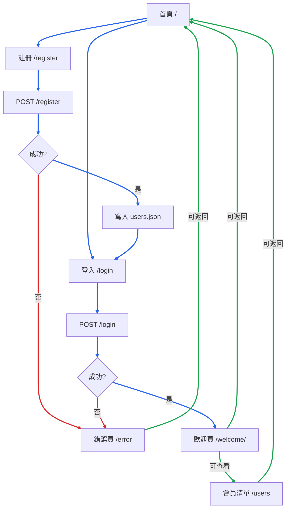

# 第 2 次小考

## 1142 Web 程式設計

:::info
注意事項

- 本小考可參考書籍或網路上任何資料，惟不可以任何方式與第三者交流溝通，若有任何不誠實的投機行為，將依校規辦理，且當次的成績 0 分計算。
- 本次小考請以 Git 上傳 GitHub，再將專案網址貼到 [【第2次小考作業】](https://forms.gle/VwADrUSboe2kJRKz6)。GitHub 專案需包含 README.md、LICENSE、.gitignore 等檔案，並完成 About 描述。
- 如有專案設定 public 可能遭其他同學看到的疑慮，可設定為 private 再將老師的郵件 peterju.tw@gmail.com 加入你專案的合作開發，並於群組通知老師收信。
- 繳交時間到之後請勿再更新答案，如超過繳交時間仍更新，則老師會參考繳交時間前最後一次 commit 的答案。
  :::

:::danger
請於 2026 年 4 月 23 日 23:59 前完成本次小考作業。
:::

# 簡易會員系統

請使用 Flask 框架設計一個「簡易會員系統」。因課程尚未講授資料庫與 Session，本系統採用 **JSON 檔案** 儲存資料，並模擬無狀態的 Web 請求流程。

## 系統功能需求

1. **首頁（`/`）**：顯示系統標題與簡介，提供「登入」、「註冊」的連結。
   
2. **註冊功能（`/register`）**：
   - GET：顯示註冊表單（帳號、Email、密碼、電話、出生日期）。
   - POST：驗證表單資料。若通過驗證，將資料存入 `users.json`，並重定向至登入頁；若失敗，導向錯誤頁。
     
3. **登入功能（`/login`）**：
   - GET：顯示登入表單（Email、密碼）。
   - POST：驗證 Email 與密碼是否匹配 `users.json` 中的記錄。若匹配，重定向至歡迎頁 `/welcome/<username>`；若失敗，導向錯誤頁。
     
4. **歡迎頁（`/welcome/<username>`）**：
   - 根據 URL 中的 `username` 從 JSON 查詢該會員資料並顯示。
   - 提供「查看會員清單」與「返回首頁」連結。
     
5. **會員清單（`/users`）**：
   - GET：讀取 `users.json`，以表格列出所有會員（帳號、Email、電話、出生日期）。
   - **注意**：本清單僅供瀏覽，不提供修改與刪除功能；密碼欄位不得顯示於網頁上。
     
6. **統一錯誤頁（`/error`）**：
   - 接收 `message` 參數（透過 `request.args`），顯示錯誤訊息。
   - 提供「返回前一頁」與「返回首頁」連結。
     

## 系統流程



## 專案結構

請依照以下結構建立專案：

```
project/
│
├── app.py
├── requirements.txt
├── templates/
│   ├── base.html          # ← 考題已提供，請勿修改結構
│   ├── index.html
│   ├── register.html
│   ├── login.html
│   ├── welcome.html
│   ├── users.html
│   └── error.html
├── static/
│   └── css/
│       └── style.css
└── users.json             # 程式啟動時若不存在則自動建立
```

## `templates/base.html`

```html
<!DOCTYPE html>
<html lang="zh-Hant">
  <head>
    <meta charset="UTF-8" />
    <meta name="viewport" content="width=device-width, initial-scale=1.0" />
    <title>會員系統</title>
    <link
      rel="stylesheet"
      href="https://cdn.jsdelivr.net/npm/@picocss/pico@2/css/pico.min.css"
    />
    <link
      rel="stylesheet"
      href="{{ url_for('static', filename='css/style.css') }}"
    />
  </head>
  <body>
    <header class="container">
      <nav>
        <ul>
          <li><strong>👥 會員系統</strong></li>
        </ul>
        <ul>
          <li><a href="{{ url_for('index') }}">首頁</a></li>
          <li><a href="{{ url_for('login_route') }}">登入</a></li>
          <li><a href="{{ url_for('register_route') }}">註冊</a></li>
        </ul>
      </nav>
    </header>
    <main class="container"></main>
    <footer class="container">
      <hr />
      <p><small>1142 Web 程式設計 - 第 2 次小考</small></p>
    </footer>
  </body>
</html>
```

:::info 🎨 Pico CSS 使用說明
本作業改用 **Pico CSS v2** 作為前端樣式框架。Pico 強調「語義化 HTML」，**絕大多數元件僅需使用標準標籤即可自動美化**，無需額外撰寫 `class`。

- **按鈕樣式**：預設為主要按鈕。若需次要色調請加 `class="secondary"`，若需外框樣式請加 `class="outline"`。
- **表格響應式**：若表格欄位較多，請在外層包裹 `<div class="overflow-auto">` 以支援手機橫向滑動。
- **避免使用 Bootstrap 語法**：本作業不使用 `.row`, `.col`, `.card`, `.btn-primary` 等類別，請直接依賴 `<article>`, `<form>`, `<button>` 等語義化標籤。
- 為節省排版時間，考題已直接提供 `base.html`，請直接複製使用，勿修改其結構。
  :::

:::info 🏷️ HTML5 語意化標籤提示
為配合 Pico CSS 的設計哲學，頁面請優先使用標準 HTML5 標籤，例如：

- `article`：包住每頁主要內容
- `form`、`label`、`input`、`button`：表單輸入與送出
- `table`、`thead`、`tbody`、`tr`、`th`、`td`：會員資料表格
- `header`、`footer`、`nav`：頁首、頁尾與導覽列

只要結構清楚、頁面可正常閱讀與操作即可，不要求額外做複雜版面設計。
:::

## JSON 資料結構 (`users.json`)

系統第一次執行時需自動初始化此檔案：

```json
{
  "users": [
    {
      "username": "admin",
      "email": "admin@example.com",
      "password": "admin123",
      "phone": "0912345678",
      "birthdate": "1990-01-01"
    }
  ]
}
```

## 作答範圍限制

本次作業請以課堂已講授的 Flask 基礎內容完成，評分亦以課堂範圍為主。

### 建議使用之內容

- Flask 基本路由與函式式 view function
- `request.form`、`request.args`
- `render_template`、`url_for`
- Jinja2 模板繼承與基本過濾器
- JSON 檔案讀寫
- HTML 表單與 GET/POST 流程
- 基本 `try/except` 錯誤處理

### 請勿使用之內容

- 資料庫（如 SQLite、MySQL、PostgreSQL、MongoDB）
- ORM 或資料庫套件（如 SQLAlchemy）
- Session、Cookie 登入狀態管理
- JavaScript framework 或額外前端套件
- Flask-WTF、Blueprint、class-based view 等未授課內容
- 複雜物件導向設計（OOP）或與課堂範例差異過大的架構

### 評分說明

- 評分重點為是否能用課堂教過的方法正確完成功能。
- 使用超出課程範圍的技術，不會因此額外加分。
- 若作答內容大量依賴未授課技術，導致無法對應課堂學習重點，將視情況扣分。

## 命名與介面規範

為避免程式與題目提供之模板無法正確對應，本作業中以下項目請保持一致。

### 1. 檔名與目錄結構

- 主程式檔名必須為 `app.py`
- 樣板檔案必須放在 `templates/`
- 樣式檔必須為 `static/css/style.css`
- 使用者資料檔必須為 `users.json`

### 2. JSON 結構

- `users.json` 最外層必須為一個 `dict`
- 最外層 key 必須為 `users`
- 每筆會員資料必須包含以下欄位名稱：
  - `username`
  - `email`
  - `password`
  - `phone`
  - `birthdate`

### 3. 路由網址

以下路由網址必須完全一致：

- `/`
- `/register`
- `/login`
- `/welcome/<username>`
- `/users`
- `/error`

### 4. 路由函式名稱

請使用以下路由函式名稱，避免 `url_for()` 對應不上：

- `index`
- `register_route`
- `login_route`
- `welcome_route`
- `users_list_route`
- `error_route`

### 5. 輔助函式名稱與簽名

請依照以下名稱與參數實作輔助函式：

```python
def init_json_file(file_path: str) -> None:
    ...

def read_users(file_path: str) -> dict:
    ...

def save_users(file_path: str, data: dict) -> bool:
    ...

def validate_register(form_data: dict, users: list) -> dict:
    ...

def verify_login(email: str, password: str, users: list) -> dict:
    ...
```

### 6. 驗證函式回傳格式

`validate_register()` 與 `verify_login()` 請統一回傳 `dict`，格式如下：

```python
# 成功
{"success": True, "data": {...}}

# 失敗
{"success": False, "error": "錯誤訊息"}
```

### 7. 自訂過濾器名稱

以下過濾器名稱請固定：

- `mask_phone`
- `format_tw_date`

## 程式設計要求

### 1. 穩定回傳結構與函式封裝

請將核心邏輯盡量封裝為獨立函式，避免將所有判斷直接寫在路由函式中。

- 請依照上方「命名與介面規範」實作指定的輔助函式與回傳格式。
- 檔案讀寫類的輔助函式可維持自然型別，例如：`None`、`dict`、`bool`。
- 驗證與登入相關函式請盡量不要依賴全域狀態，所需資料應透過參數傳入。
- 可自行增加其他輔助函式，但不得省略題目指定之函式。

### 2. 表單驗證規則

- 帳號、Email、密碼、出生日期為必填（不可為空或純空白）。
- Email 必須包含 `@` 與 `.`。
- 電話為選填，若有填寫則需為 10 碼數字且開頭為 `09`。
- 密碼長度需介於 6~16 字元。
- 帳號與 Email 不得與 JSON 中既有資料重複。
- 本次小考**不要求前端驗證或 JavaScript 驗證**，僅需在**後端**完成欄位驗證即可，後端也無需安裝與驗證有關的套件。
- 若驗證失敗，請導向錯誤頁或回傳明確錯誤訊息；重點是能清楚告知使用者失敗原因。
- 若學生額外加入 HTML5 驗證屬性（如 `required`、`type="email"`）不扣分，但**不列為必備評分項目**。

### 3. 自訂過濾器

請在 `app.py` 中定義自訂過濾器，並於樣板中實際使用。過濾器名稱請依照上方「命名與介面規範」固定為 `mask_phone` 與 `format_tw_date`。

### 4. 路由與樣板規範

- 所有頁面需使用 `render_template` 渲染，並正確使用 `url_for` 產生連結。
- 顯示表單頁面使用 `GET`，表單送出一律使用 `POST` 方法。
- 路由函式名稱請依照上方「命名與介面規範」實作。
- **初始化時機**：`init_json_file()` 必須寫在模組層級（`if __name__` 之外），確保 `flask run` 匯入模組時自動執行。
- 請勿任意更改題目提供之模板中 `url_for()` 所對應的端點名稱。

### 5. 程式碼規範

- 遵循 PEP 8 格式。
- 每個函式需撰寫簡短 docstring 說明功能與回傳值。
- **鼓勵**使用 Python 3.10+ 內建型別提示（如 `dict`, `list`, `str`, `bool`, `None`），**無需 `import typing`**。
- 檔案讀寫需使用 `try/except` 精準捕捉 `FileNotFoundError` 或 `json.JSONDecodeError`。
- 本次小考以 `FileNotFoundError` 與 `json.JSONDecodeError` 的處理為主，其餘例外不要求全面處理。

## 提示

- Python 基礎（Flask 先修指南）講義第五章強調：防呆與例外處理應精準，不建議使用裸 `except`。
- Python 基礎（Flask 先修指南）講義第一章強調：參數進，return 出；不要偷拿外部資料。
- 讀取 JSON 範例：
  ```python
  import json
  try:
      with open("users.json", "r", encoding="utf-8") as f:
          return json.load(f)
  except FileNotFoundError:
      return {"users": []}
  except json.JSONDecodeError:
      return {"users": []}
  ```
- 表單取值建議使用預設值防呆：`request.form.get("email", "").strip()`
- **啟動指令**：請統一使用 `flask --debug run`。Flask CLI 會以模組匯入方式載入 `app.py`，因此初始化邏輯需寫在模組層級。

## 自我測試步驟

1. 首次執行 `flask --debug run`，`users.json` 應自動建立且含 `admin` 預設資料。
2. 註冊時未輸入密碼或輸入 `abc@`（無 `.`）的 Email，應導向錯誤頁提示。
3. 使用重複的帳號或 Email 註冊，應導向錯誤頁提示。
4. 登入時使用正確的 `admin@example.com` 與 `admin123`，應成功導向 `/welcome/admin`。
5. 訪問 `/users`，表格應顯示 `admin` 資料，電話顯示 `0912****78`，出生日期顯示民國年，**密碼欄位不可見**。
6. 錯誤頁面點擊「返回前一頁」應回到上一頁。

## 評分標準

| 項目               | 比重 | 評分重點                                                               |
| ------------------ | ---- | ---------------------------------------------------------------------- |
| **功能完整性**     | 60%  | 6 個核心路由運作正常；JSON 讀寫與初始資料正確；驗證規則落實            |
| **驗證與錯誤處理** | 20%  | 註冊與登入驗證合理；錯誤頁可正確顯示訊息；基本例外處理完整             |
| **樣板與頁面呈現** | 10%  | 正確使用樣板繼承、`url_for`、`request.form/args`，頁面可正常操作與閱讀 |
| **程式碼品質**     | 10%  | 結構清楚、適度函式封裝、PEP 8、docstring，進階設計會列入加分參考       |
